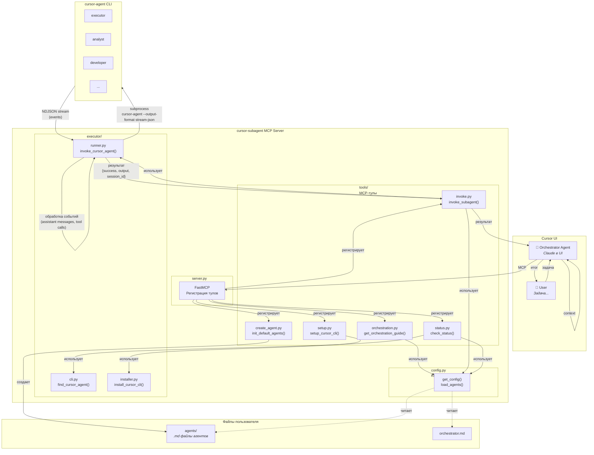

# Cursor Subagent MCP Server

MCP-сервер для оркестрации мультиагентной разработки в Cursor. Позволяет основному агенту в UI Cursor вызывать специализированных субагентов через `cursor-agent` CLI.

## Зачем это нужно?

### 🧠 Контекст не разбухает

При работе над большой задачей контекст основного агента быстро переполняется. С мультиагентным подходом:
- Каждый субагент работает в **изолированном контексте**
- Основной агент хранит только **результаты** работы субагентов
- Можно выполнять задачи любой сложности без потери контекста

### 🛠️ Гибкость и Кастомизация

Вы полностью контролируете своих агентов:
- Агенты определяются через Markdown файлы в вашем проекте
- Вы можете изменять промпты, создавать новые роли и настраивать поведение
- Легко адаптировать агентов под специфику вашего проекта или стека

### 📝 Готовые шаблоны (Default Agents)

Не нужно начинать с нуля. Вы можете инициализировать стандартный набор проверенных агентов:
- **9 специализированных ролей** (Аналитик, Архитектор, Разработчик и др.)
- Отточенные промпты для каждой стадии разработки
- Готовая структура взаимодействия

### 🔄 Отлаженный workflow

Процесс разработки структурирован и предсказуем:
- **Анализ → Архитектура → Планирование → Разработка**
- Каждый этап включает review с ограничением итераций
- Автоматическая остановка при критичных проблемах

### ⚡ Параллельная работа

Субагенты запускаются через отдельные процессы `cursor-agent`:
- Не блокируют основной агент
- Могут использовать разные модели для разных задач
- Результаты кэшируются и переиспользуются

## Архитектура



### Как работает workflow

1. **User** даёт задачу Orchestrator Agent в Cursor UI
2. **Orchestrator** вызывает `get_orchestration_guide()` — получает инструкции и список доступных агентов (из папки `agents/`)
3. **Orchestrator** строит план и вызывает нужных агентов по очереди
4. Результат каждого агента передаётся следующему через параметр `context`
5. **Orchestrator** возвращает финальный результат пользователю

## Быстрый старт

### 1. Установка

```bash
git clone https://github.com/your-repo/cursor-subagent-mcp
cd cursor-subagent-mcp
uv sync
```

### 2. Настройка MCP

Добавьте в ваш `~/.cursor/mcp.json` (или настройки проекта):

```json
{
  "mcpServers": {
    "cursor-subagent": {
      "command": "/Users/<user>/.local/bin/uv",
      "args": [
        "--directory",
        "/path/to/cursor-subagent-mcp",
        "run",
        "cursor-subagent-mcp"
      ],
      "env": {
        "CURSOR_AGENTS_DIR": "/absolute/path/to/your/agents/dir"
      }
    }
  }
}
```

> **Важно:** 
> 1. Замените `/path/to/cursor-subagent-mcp` на путь к репозиторию.
> 2. `CURSOR_AGENTS_DIR` указывает, где искать определения агентов. По умолчанию ищет папку `agents` в корне проекта.

### 3. Инициализация агентов

Впервые в проекте? Попросите агента создать стандартные файлы:

```
Вызови init_default_agents для создания базовых агентов
```

Это создаст папку `agents/` с файлами `.md` для каждого агента (Analyst, Developer, etc.). Теперь вы можете редактировать их промпты!

### 4. Установка cursor-agent CLI

Попросите агента:
```
Вызови setup_cursor_cli для установки cursor-agent
```

Или вручную:
```bash
curl -L https://cursor.com/install | gunzip | bash

# Добавление в PATH (для bash)
echo 'export PATH="$HOME/.local/bin:$PATH"' >> ~/.bashrc
source ~/.bashrc

# Или для zsh
echo 'export PATH="$HOME/.local/bin:$PATH"' >> ~/.zshrc
source ~/.zshrc
```

### 4. Проверка

```
Вызови check_status
```

Ожидаемый ответ:
```json
{
  "cursor_agent_available": true,
  "cursor_agent_message": "cursor-agent found at: /Users/.../.local/bin/cursor-agent",
  "config_loaded": true,
  "agent_count": 9
}
```

## Использование

Просто дайте задачу агенту:

```
Разработай REST API для управления пользователями с авторизацией через JWT.
```

Агент автоматически:
1. Вызовет `get_orchestration_guide()`
2. Прочитает конфигурацию ваших агентов из `agents/`
3. Запустит workflow, вызывая субагентов

## MCP Tools

| Tool | Описание |
|------|----------|
| `get_orchestration_guide()` | ⭐ **Вызывать первым!** Возвращает инструкции + список доступных агентов |
| `invoke_subagent(agent_role, task, context)` | Вызывает субагента по его роли (имени файла) |
| `create_agent_scaffold(path, name)` | Создает заготовку для нового агента |
| `init_default_agents(force)` | Копирует стандартные агенты в ваш проект |
| `check_status()` | Проверяет статус и конфигурацию |
| `setup_cursor_cli()` | Устанавливает CLI |

## Агенты

Агенты — это просто Markdown файлы в вашей папке `agents/`.
Имя файла (без расширения) становится `role` агента.

Пример `agents/developer.md`:

```markdown
---
name: Developer
description: Реализует код по плану
default_model: composer-1
---

# Invocation Rules
Вызывай этого агента, когда нужно написать код...

# Prompt
Ты опытный разработчик...
```

### Стандартный набор (после init_default_agents)

| Роль | Описание | Файл |
|------|----------|------|
| `executor` | Простые задачи, исследование | `executor.md` |
| `analyst` | Создаёт ТЗ | `analyst.md` |
| `tz_reviewer` | Проверяет ТЗ | `tz_reviewer.md` |
| `architect` | Проектирует архитектуру | `architect.md` |
| `developer` | Пишет код | `developer.md` |
| ... | ... | ... |

## Технические детали

### Конфигурация

Конфигурация агентов загружается динамически из папки, указанной в `CURSOR_AGENTS_DIR` (или `./agents`).
`agents.yaml` больше не используется — каждый агент сам описывает свои метаданные в Frontmatter (YAML заголовок в начале файла).

### Обработка потоков

Сервер использует `cursor-agent` CLI с флагом `--approve-mcps` для автоматического одобрения запросов к MCP серверам во время выполнения субагентов.

## Лицензия

MIT
