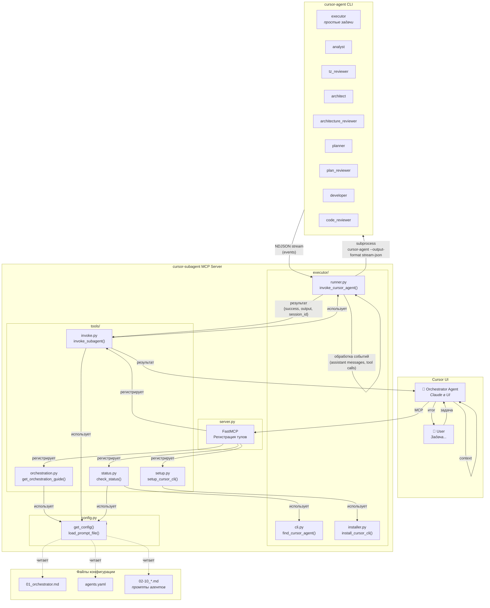
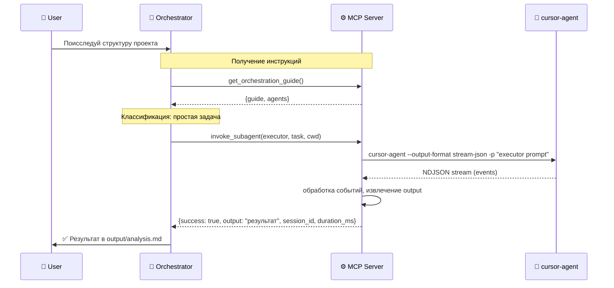
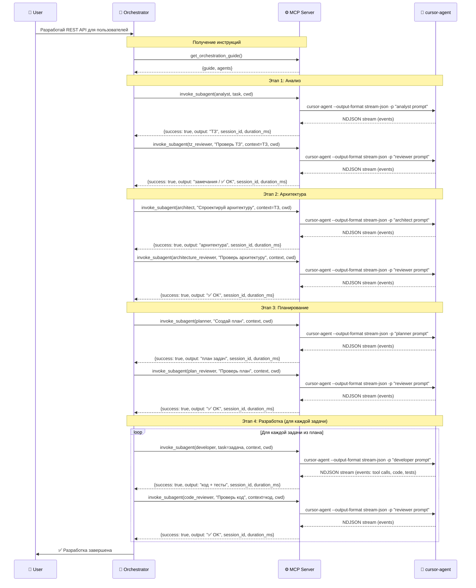

# Cursor Subagent MCP Server

MCP-сервер для оркестрации мультиагентной разработки в Cursor. Позволяет основному агенту в UI Cursor вызывать специализированных субагентов через `cursor-agent` CLI.

## Зачем это нужно?

### 🧠 Контекст не разбухает

При работе над большой задачей контекст основного агента быстро переполняется. С мультиагентным подходом:
- Каждый субагент работает в **изолированном контексте**
- Основной агент хранит только **результаты** работы субагентов
- Можно выполнять задачи любой сложности без потери контекста

### 📝 Готовые промпты для каждой роли

Не нужно каждый раз придумывать как правильно поставить задачу:
- **9 специализированных агентов** с отточенными промптами
- Executor для простых задач, Аналитик, Архитектор, Планировщик, Разработчик и их ревьюеры
- Промпты оптимизированы для качественного результата

### 🔄 Отлаженный workflow

Процесс разработки структурирован и предсказуем:
- **Анализ → Архитектура → Планирование → Разработка**
- Каждый этап включает review с ограничением итераций
- Автоматическая остановка при критичных проблемах

### ⚡ Параллельная работа

Субагенты запускаются через отдельные процессы `cursor-agent`:
- Не блокируют основной агент
- Могут использовать разные модели для разных задач
- Результаты кэшируются и переиспользуются

### 🎯 Разделение ответственности

Каждый агент фокусируется на своей задаче:
- **Аналитик** — только ТЗ, не пишет код
- **Архитектор** — только архитектура, не реализация
- **Разработчик** — строго по плану, не рефакторит лишнее
- **Ревьюеры** — независимая проверка качества

## Архитектура



### Как работает workflow

1. **User** даёт задачу Orchestrator Agent в Cursor UI
2. **Orchestrator** вызывает `get_orchestration_guide()` — получает инструкции и список агентов
3. **Orchestrator** классифицирует задачу:

   **Простая задача** (исследование, мелкие правки, добавление атрибутов):
   - Вызывает `executor` напрямую → получает результат

   **Сложная задача** (новый функционал, архитектурные изменения):
   - `analyst` → `tz_reviewer` → `architect` → `architecture_reviewer` → `planner` → `plan_reviewer` → `developer` → `code_reviewer`

4. Результат каждого агента передаётся следующему через параметр `context`
5. **Orchestrator** возвращает финальный результат пользователю

> **Важно:** Orchestrator — только координатор! Он НЕ исследует код, НЕ анализирует проект сам. Всё делегируется субагентам через `invoke_subagent()`.

### Структура проекта

Проект организован в модульную структуру с четким разделением ответственности:

```
src/cursor_subagent_mcp/
├── server.py              # Точка входа, инициализация FastMCP, регистрация MCP-тулов
├── config.py             # Управление конфигурацией (singleton, загрузка agents.yaml)
├── tools/                 # MCP-тулы (бизнес-логика)
│   ├── __init__.py       # Публичный API модуля tools
│   ├── orchestration.py  # get_orchestration_guide() - получение инструкций и списка агентов
│   ├── invoke.py         # invoke_subagent() - вызов субагентов
│   ├── setup.py          # setup_cursor_cli() - установка cursor-agent CLI
│   └── status.py         # check_status() - проверка статуса сервера
└── executor/             # Выполнение cursor-agent CLI
    ├── __init__.py       # Публичный API модуля executor
    ├── runner.py         # invoke_cursor_agent() - основная логика выполнения с обработкой NDJSON
    ├── cli.py            # find_cursor_agent(), check_cursor_agent_available()
    ├── shell.py          # detect_shell(), get_shell_config_file()
    ├── installer.py      # install_cursor_cli() - установка CLI
    ├── logging.py        # get_logger() - настройка логирования
    ├── models.py         # StreamEvent, ExecutionResult - модели данных
    └── utils.py          # strip_ansi(), extract_final_json() - утилиты
```

**Слои архитектуры:**

1. **Слой инициализации** (`server.py`) - точка входа, регистрация MCP-тулов через FastMCP
2. **Слой инструментов** (`tools/`) - MCP-тулы, бизнес-логика оркестрации
   - `orchestration.py` - загрузка системного оркестратора из пакета
   - `setup.py` - установка CLI и инициализация агентов
3. **Слой выполнения** (`executor/`) - выполнение cursor-agent CLI, обработка потоков событий
4. **Слой конфигурации** (`config.py`) - управление конфигурацией, загрузка пользовательских агентов из `CURSOR_AGENTS_DIR`

**Зависимости между слоями:**

- `server.py` → `tools/` (регистрация тулов)
- `tools/` → `executor/` (выполнение агентов), `config.py` (загрузка конфигурации)
- `executor/` → независимый модуль (логи пишет в `./logs`)
- `config.py` → нет зависимостей (базовый модуль)

### Sequence диаграмма (простые задачи)



### Sequence диаграмма (сложные задачи)



## Быстрый старт

### 1. Установка

```bash
git clone https://github.com/your-repo/cursor-subagent-mcp
cd cursor-subagent-mcp
uv sync
```

### 2. Настройка MCP

```json
{
  "mcpServers": {
    "cursor-subagent": {
      "command": "/Users/<user>/.local/bin/uv",
      "args": [
        "--directory",
        "/path/to/cursor-subagent-mcp",
        "run",
        "cursor-subagent-mcp"
      ],
      "env": {
        "CURSOR_AGENTS_DIR": "/absolute/path/to/your/agents/dir"
      }
    }
  }
}
```

> **Важно:** 
> 1. Замените `/path/to/cursor-subagent-mcp` на реальный путь к клонированному репозиторию.
> 2. `CURSOR_AGENTS_DIR` указывает на папку, где будут храниться определения ваших агентов. Если не указано, сервер будет искать папку `agents` в текущей рабочей директории.

### 3. Инициализация агентов (Optional)

Если у вас ещё нет настроенных агентов, вы можете инициализировать стандартный набор в вашу папку:

```
Вызови init_default_agents для создания базовых агентов
```

Это скопирует стандартные определения (Analyst, Developer и др.) в директорию, указанную в `CURSOR_AGENTS_DIR` (или `./agents`).

### 4. Установка cursor-agent CLI

Попросите агента:
```
Вызови setup_cursor_cli для установки cursor-agent
```

Или вручную:
```bash
curl -L https://cursor.com/install | gunzip | bash

# Добавление в PATH (для bash)
echo 'export PATH="$HOME/.local/bin:$PATH"' >> ~/.bashrc
source ~/.bashrc

# Или для zsh
echo 'export PATH="$HOME/.local/bin:$PATH"' >> ~/.zshrc
source ~/.zshrc
```

### 4. Проверка

```
Вызови check_status
```

Ожидаемый ответ:
```json
{
  "cursor_agent_available": true,
  "cursor_agent_message": "cursor-agent found at: /Users/.../.local/bin/cursor-agent",
  "config_loaded": true,
  "agent_count": 9
}
```

## Использование

Просто дайте задачу агенту:

```
Разработай REST API для управления пользователями с авторизацией через JWT.
```

Агент автоматически:
1. Вызовет `get_orchestration_guide()` — получит инструкции
2. Запустит workflow: analyst → tz_reviewer → architect → ... → code_reviewer
3. Передаст результаты между агентами через `context`

## MCP Tools

| Tool | Описание |
|------|----------|
| `get_orchestration_guide()` | ⭐ **Вызывать первым!** Возвращает инструкции + список агентов |
| `invoke_subagent(agent_role, task, context)` | Вызывает субагента |
| `check_status()` | Проверяет доступность cursor-agent CLI |
| `setup_cursor_cli()` | Устанавливает cursor-agent CLI |
| `init_default_agents(force)` | Инициализирует стандартные агенты в папку пользователя |

### invoke_subagent

```python
invoke_subagent(
    agent_role="executor",     # executor, analyst, architect, planner, developer, *_reviewer
    task="Поисследуй проект",  # задача
    cwd="/path/to/project",    # рабочая директория (обязательно)
    context="...",             # код проекта или результаты предыдущих агентов (опционально)
    model="claude-sonnet-4",   # опционально, переопределяет default_model из agents.yaml
    timeout=300                # опционально, таймаут в секундах
)
```

**Возвращает:**
```json
{
  "success": true,
  "output": "Результат работы агента...",
  "error": null,
  "agent_role": "analyst",
  "model_used": "claude-sonnet-4-20250514",
  "session_id": "f8122bb0-535f-480e-b781-66b95461827b",
  "duration_ms": 45000
}
```

**Примечания:**
- `output` содержит результат работы агента (текст или JSON, если агент вернул JSON)
- `session_id` - уникальный идентификатор сессии cursor-agent
- `duration_ms` - время выполнения в миллисекундах
- При ошибках HTTP-соединения (например, "Premature close"), если есть полезный вывод, результат считается успешным

## Агенты

| Роль | Описание | Промпт | Модель по умолчанию |
|------|----------|--------|---------------------|
| `executor` | **Простые задачи:** исследование, мелкие правки, добавление атрибутов | `10_executor_agent.md` | `composer-1` |
| `analyst` | Создаёт ТЗ с юзер-кейсами | `02_analyst_prompt.md` | `opus-4.5-thinking` |
| `tz_reviewer` | Проверяет качество ТЗ | `03_tz_reviewer_prompt.md` | `composer-1` |
| `architect` | Проектирует архитектуру | `04_architect_prompt.md` | `opus-4.5-thinking` |
| `architecture_reviewer` | Проверяет архитектуру | `05_architecture_reviewer_prompt.md` | `composer-1` |
| `planner` | Создаёт план задач | `06_agent_planner.md` | `opus-4.5-thinking` |
| `plan_reviewer` | Проверяет план | `07_agent_plan_reviewer.md` | `composer-1` |
| `developer` | Реализует код и тесты | `08_agent_developer.md` | `composer-1` |
| `code_reviewer` | Проверяет код | `09_agent_code_reviewer.md` | `composer-1` |

Промпты находятся в `agents-master/`. Конфигурация агентов в `agents.yaml`.

## Конфигурация

`agents.yaml`:

```yaml
agents:
  analyst:
    name: "Аналитик"
    description: "Создаёт ТЗ с юзер-кейсами"
    prompt_file: "agents-master/02_analyst_prompt.md"
    default_model: "claude-sonnet-4-20250514"
```

## Технические детали

### Обработка потоков

Сервер использует `cursor-agent` CLI с форматом `stream-json` для получения событий в реальном времени:
- События обрабатываются построчно (NDJSON формат)
- Извлекаются сообщения ассистента, вызовы инструментов, результаты
- Логирование всех событий в `logs/agents_YYYY-MM-DD.log`

### Обработка ошибок

- **Premature close / NGHTTP2_INTERNAL_ERROR**: Если процесс завершился с такой ошибкой, но есть полезный вывод (>100 символов), результат считается успешным
- Потоки не закрываются вручную - процесс завершается естественным образом
- Все ошибки логируются с контекстом выполнения

### Логирование

Логи сохраняются в `logs/agents_YYYY-MM-DD.log` с уровнем детализации:
- `INFO`: Запуск агентов, чтение/запись файлов, завершение
- `DEBUG`: События потока, обработка ошибок
- `WARNING`: Предупреждения (например, JSON не найден в ответе)
- `ERROR`: Ошибки выполнения

## Разработка

### Структура модулей

Проект использует модульную архитектуру с четким разделением ответственности:

- **`server.py`** - точка входа, инициализирует FastMCP и регистрирует все MCP-тулы из `tools/`
- **`tools/`** - содержит реализацию всех MCP-тулов:
  - `orchestration.py` - загрузка инструкций оркестратора и списка агентов
  - `invoke.py` - вызов субагентов через cursor-agent CLI
  - `setup.py` - установка и настройка cursor-agent CLI
  - `status.py` - проверка статуса сервера и зависимостей
- **`executor/`** - модули для выполнения cursor-agent CLI:
  - `runner.py` - основная логика выполнения с обработкой NDJSON потока
  - `cli.py` - поиск и проверка доступности cursor-agent
  - `shell.py` - определение оболочки пользователя
  - `installer.py` - установка cursor-agent CLI
  - `logging.py` - настройка логирования в файлы
  - `models.py` - модели данных (StreamEvent, ExecutionResult)
  - `utils.py` - утилиты для работы с текстом (удаление ANSI кодов, извлечение JSON)
- **`config.py`** - управление конфигурацией (singleton паттерн, загрузка `agents.yaml`)

### Запуск

```bash
# Запуск тестов
uv run pytest

# Локальный запуск сервера
uv run cursor-subagent-mcp
```

### Добавление нового MCP-тула

1. Создайте новый модуль в `tools/` (например, `tools/my_tool.py`)
2. Реализуйте функцию тула
3. Добавьте экспорт в `tools/__init__.py`
4. Зарегистрируйте тул в `server.py` через декоратор `@mcp.tool()`

### Добавление нового модуля в executor

1. Создайте новый модуль в `executor/` (например, `executor/my_module.py`)
2. Реализуйте необходимые функции
3. Если функции должны быть доступны извне executor, добавьте экспорт в `executor/__init__.py`
4. Используйте функции в других модулях через импорт из `executor`

## Лицензия

MIT
