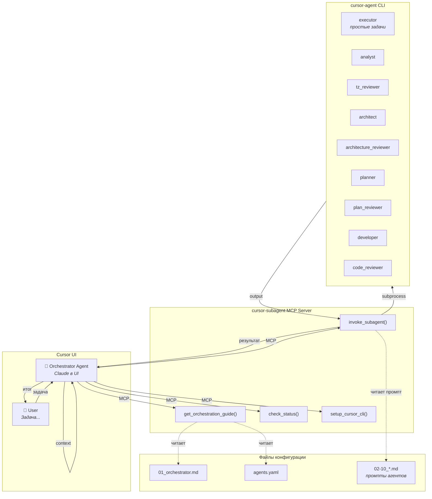
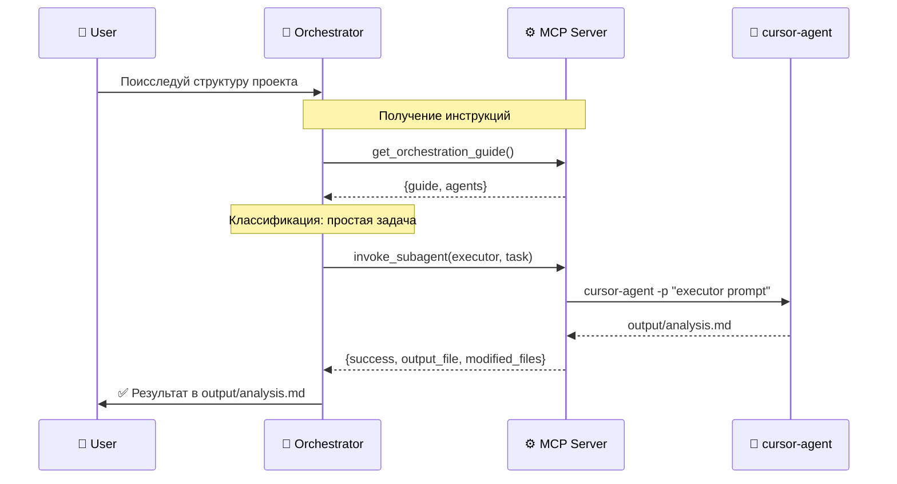
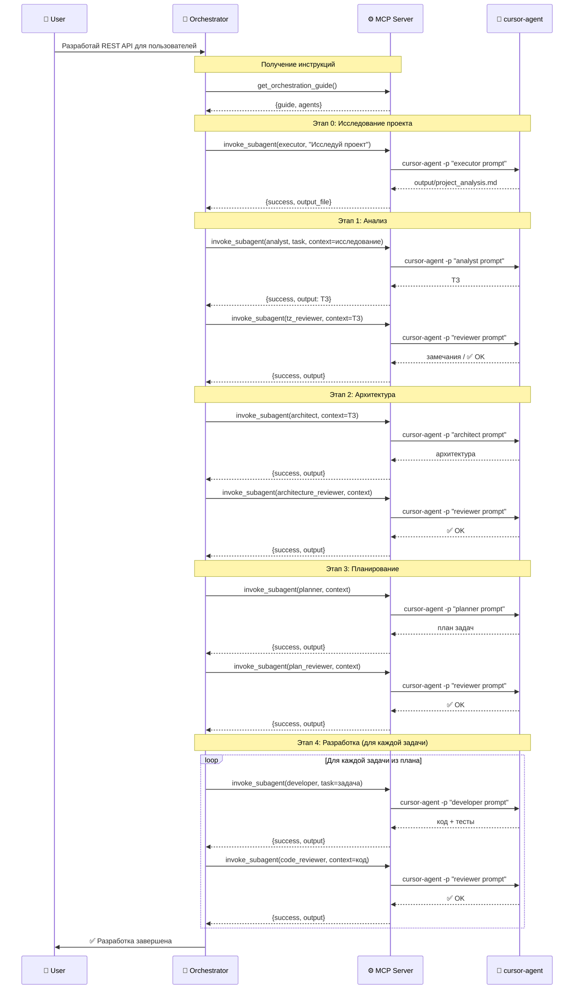

# Cursor Subagent MCP Server

MCP-сервер для оркестрации мультиагентной разработки в Cursor. Позволяет основному агенту в UI Cursor вызывать специализированных субагентов через `cursor-agent` CLI.

## Зачем это нужно?

### 🧠 Контекст не разбухает

При работе над большой задачей контекст основного агента быстро переполняется. С мультиагентным подходом:
- Каждый субагент работает в **изолированном контексте**
- Основной агент хранит только **результаты** работы субагентов
- Можно выполнять задачи любой сложности без потери контекста

### 📝 Готовые промпты для каждой роли

Не нужно каждый раз придумывать как правильно поставить задачу:
- **9 специализированных агентов** с отточенными промптами
- Executor для простых задач, Аналитик, Архитектор, Планировщик, Разработчик и их ревьюеры
- Промпты оптимизированы для качественного результата

### 🔄 Отлаженный workflow

Процесс разработки структурирован и предсказуем:
- **Анализ → Архитектура → Планирование → Разработка**
- Каждый этап включает review с ограничением итераций
- Автоматическая остановка при критичных проблемах

### ⚡ Параллельная работа

Субагенты запускаются через отдельные процессы `cursor-agent`:
- Не блокируют основной агент
- Могут использовать разные модели для разных задач
- Результаты кэшируются и переиспользуются

### 🎯 Разделение ответственности

Каждый агент фокусируется на своей задаче:
- **Аналитик** — только ТЗ, не пишет код
- **Архитектор** — только архитектура, не реализация
- **Разработчик** — строго по плану, не рефакторит лишнее
- **Ревьюеры** — независимая проверка качества

## Архитектура



### Как работает workflow

1. **User** даёт задачу Orchestrator Agent в Cursor UI
2. **Orchestrator** вызывает `get_orchestration_guide()` — получает инструкции и список агентов
3. **Orchestrator** классифицирует задачу:

   **Простая задача** (исследование, мелкие правки, добавление атрибутов):
   - Вызывает `executor` напрямую → получает результат

   **Сложная задача** (новый функционал, архитектурные изменения):
   - **Сначала**: `executor` (исследование проекта)
   - **Затем**: `analyst` → `tz_reviewer` → `architect` → `architecture_reviewer` → `planner` → `plan_reviewer` → `developer` → `code_reviewer`

4. Результат каждого агента передаётся следующему через параметр `context`
5. **Orchestrator** возвращает финальный результат пользователю

> **Важно:** Orchestrator — только координатор! Он НЕ исследует код, НЕ анализирует проект сам. Всё делегируется субагентам через `invoke_subagent()`.

### Sequence диаграмма (простые задачи)



### Sequence диаграмма (сложные задачи)



## Быстрый старт

### 1. Установка

```bash
git clone https://github.com/your-repo/cursor-subagent-mcp
cd cursor-subagent-mcp
uv sync
```

### 2. Настройка MCP

Создайте `.cursor/mcp.json`:

```json
{
  "mcpServers": {
    "cursor-subagent": {
      "command": "uv",
      "args": ["run", "--directory", "/path/to/cursor-subagent-mcp", "cursor-subagent-mcp"]
    }
  }
}
```

> **Важно:** Замените `/path/to/cursor-subagent-mcp` на реальный путь к клонированному репозиторию.

### 3. Установка cursor-agent CLI

Попросите агента:
```
Вызови setup_cursor_cli для установки cursor-agent
```

Или вручную:
```bash
curl -L https://cursor.com/install | gunzip | bash

# Добавление в PATH (для bash)
echo 'export PATH="$HOME/.local/bin:$PATH"' >> ~/.bashrc
source ~/.bashrc

# Или для zsh
echo 'export PATH="$HOME/.local/bin:$PATH"' >> ~/.zshrc
source ~/.zshrc
```

### 4. Проверка

```
Вызови check_status
```

Ожидаемый ответ:
```json
{
  "cursor_agent_available": true,
  "cursor_agent_message": "cursor-agent found at: /Users/.../.local/bin/cursor-agent",
  "config_loaded": true,
  "agent_count": 9
}
```

## Использование

Просто дайте задачу агенту:

```
Разработай REST API для управления пользователями с авторизацией через JWT.
```

Агент автоматически:
1. Вызовет `get_orchestration_guide()` — получит инструкции
2. Запустит workflow: analyst → tz_reviewer → architect → ... → code_reviewer
3. Передаст результаты между агентами через `context`

## MCP Tools

| Tool | Описание |
|------|----------|
| `get_orchestration_guide()` | ⭐ **Вызывать первым!** Возвращает инструкции + список агентов |
| `invoke_subagent(agent_role, task, context)` | Вызывает субагента |
| `check_status()` | Проверяет доступность cursor-agent CLI |
| `setup_cursor_cli()` | Устанавливает cursor-agent CLI |

### invoke_subagent

```python
invoke_subagent(
    agent_role="executor",     # executor, analyst, architect, planner, developer, *_reviewer
    task="Поисследуй проект",  # задача
    context="...",             # код проекта или результаты предыдущих агентов
    model="claude-sonnet-4",   # опционально
    timeout=300                # опционально
)
```

**Возвращает:**
```json
{
  "success": true,
  "output": "Результат работы агента...",
  "error": null,
  "agent_role": "analyst",
  "model_used": "claude-sonnet-4-20250514"
}
```

## Агенты

| Роль | Описание | Промпт |
|------|----------|--------|
| `executor` | **Простые задачи:** исследование, мелкие правки, добавление атрибутов | `10_executor_agent.md` |
| `analyst` | Создаёт ТЗ с юзер-кейсами | `02_analyst_prompt.md` |
| `tz_reviewer` | Проверяет качество ТЗ | `03_tz_reviewer_prompt.md` |
| `architect` | Проектирует архитектуру | `04_architect_prompt.md` |
| `architecture_reviewer` | Проверяет архитектуру | `05_architecture_reviewer_prompt.md` |
| `planner` | Создаёт план задач | `06_agent_planner.md` |
| `plan_reviewer` | Проверяет план | `07_agent_plan_reviewer.md` |
| `developer` | Реализует код и тесты | `08_agent_developer.md` |
| `code_reviewer` | Проверяет код | `09_agent_code_reviewer.md` |

Промпты находятся в `agents-master/`. Конфигурация агентов в `agents.yaml`.

## Конфигурация

`agents.yaml`:

```yaml
agents:
  analyst:
    name: "Аналитик"
    description: "Создаёт ТЗ с юзер-кейсами"
    prompt_file: "agents-master/02_analyst_prompt.md"
    default_model: "claude-sonnet-4-20250514"
```

## Разработка

```bash
# Запуск тестов
uv run pytest

# Локальный запуск сервера
uv run cursor-subagent-mcp
```

## Лицензия

MIT
